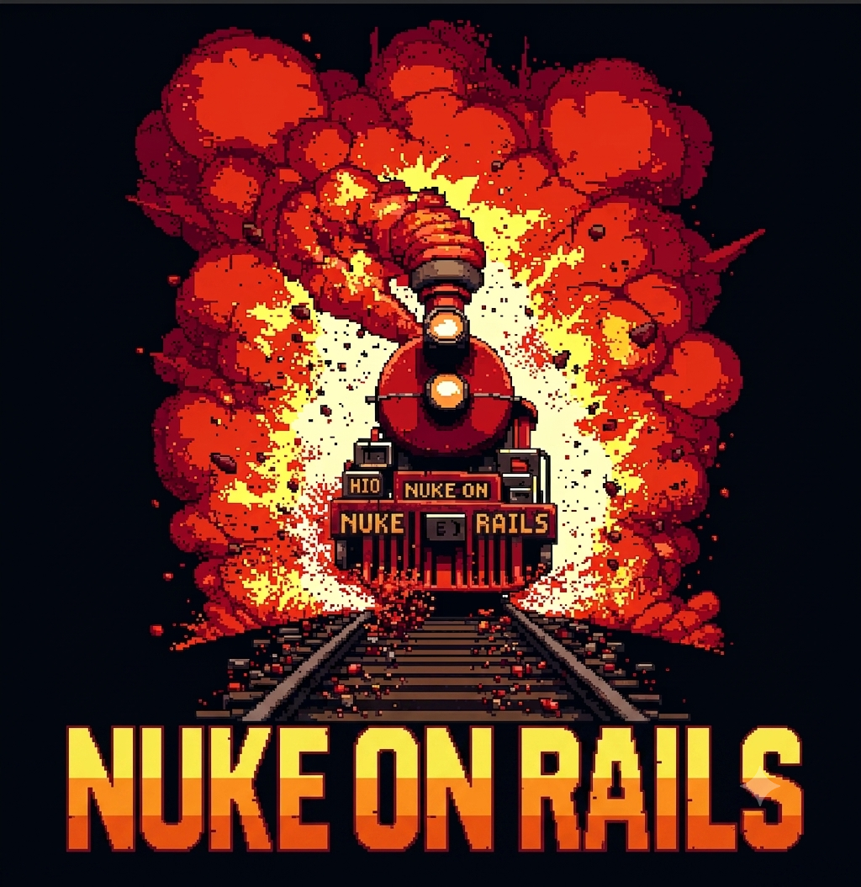

<div align="center">



### One command. Every risk in your Rails app, ranked by impact.

<a href="https://twitter.com/alanalvestech">
  
</a>
<a href="https://www.linkedin.com/in/alanalvestech/">
  
</a>
<a href="LICENSE">
  
</a>

</div>

<br />

<p align="center">
  <a href="#what-it-is">What It Is</a> &nbsp;&bull;&nbsp;
  <a href="#what-it-catches">What It Catches</a> &nbsp;&bull;&nbsp;
  <a href="#how-it-works">How It Works</a> &nbsp;&bull;&nbsp;
  <a href="#quick-start">Quick Start</a>
</p>

---

## What it is

**Nuke on Rails** is an open-source **skill** for AI coding agents (Claude Code, Cursor, Codex, and more), not a gem you add to your Gemfile. It audits your Rails app the way a principal engineer would: *what to refactor, what's vulnerable, and in what order to fix it.*

Instead of stapling separate tool reports together, it returns **a single list, ranked by impact**. An IDOR in your payments controller outranks a fat model; a high-churn fat model outranks a theoretical warning.

Scanners list problems. Nuke on Rails decides the order.

## Quick Start

Nuke on Rails ships through the [`skills`](https://skills.sh) CLI. You'll need [Node.js](https://nodejs.org).

**1. Install the `skills` CLI:**

```sh
npm install -g skills
```

**2. Add Nuke on Rails** (from your project root):

```sh
skills add nuke-on-rails/nuke-on-rails
```

It works across agents: Claude Code, Cursor, Codex, Gemini CLI, Warp, and more.

**3. Run it** inside your agent:

```
/nuke-on-rails
```

Zero setup beyond that. It installs its own tools, detects Rails vs. plain Ruby, runs everything, and hands you the plan. It never touches your Gemfile.

**4. Update** when you want the latest checks and fixes:

```sh
skills update nuke-on-rails
```

## Why not just ask the agent to "review my code"?

You can, and it'll find something. But "review my Rails app" gives a different, shallower answer every time and skips everything a deterministic scanner catches. The difference:

| | Asking an agent to "review my code" | Nuke on Rails |
|---|---|---|
| **Scanning** | The model eyeballs whatever files it happens to read | Brakeman parses 100% of the AST; bundler-audit and ruby_audit check every locked gem |
| **Reproducible** | A different answer every run | Deterministic engines plus a fixed methodology |
| **Where it looks** | Wherever the model wanders, until context runs out | Churn × complexity picks the hotspots that actually matter |
| **CVEs & EOL** | Bounded by the training cutoff; can't know yesterday's CVE | Live advisory DB, day-zero web cross-checks, end-of-life detection |
| **False positives** | Confidently reports plausible-but-wrong issues | Every security finding adversarially verified; unprovable ones flagged "theoretical" |
| **Coverage** | Whatever it remembers to check that day | A fixed OWASP Top 10 arsenal, every run |
| **Output** | A wall of prose | One list ranked by impact, with a fix-now plan |

The LLM still does the part it's good at: reading code paths, explaining exploits, judging severity. It just doesn't do it alone, from memory, and unprioritized.

## What it catches

Coverage maps to the **OWASP Top 10 2025**. Each area is a weapon in the [arsenal](arsenal/): a plain-markdown check the audit applies on top of the scanners.
<details open>
<summary><strong><a href="arsenal/authorization.md">Access control & IDOR</a></strong></summary>

* Records loaded by id without ownership scoping (the canonical payments / orders / invoices case)
* Authorization missing where authentication exists (logged-in is not allowed-to)
* Mass assignment: `permit!`, role escalation, nested attributes, raw-Hash bypass
* Records leaked through form dropdowns and serializers
* Cross-tenant leaks in multi-tenant apps; routes exposing actions that shouldn't be public

</details>

<details>
<summary><strong><a href="arsenal/authentication.md">Authentication & sessions</a></strong></summary>

* Devise misconfig: user enumeration, no lockout, sessions that never expire, weak password policy
* Session fixation and missing cookie flags (`secure` / `httponly` / `SameSite`)
* Timing attacks and type-juggling on token and credential lookups
* Tokens stored in plaintext or without expiry; rate-limit / throttle bypass
* Custom Warden strategy bugs, scope confusion, impersonation gaps; JWT pitfalls (`none` alg, no expiry)

</details>

<details>
<summary><strong><a href="arsenal/secrets.md">Secrets</a></strong></summary>

* `master.key`, credentials keys, or `.env` committed to git (including in history)
* Hardcoded API keys (Stripe, AWS, Twilio…) in code and initializers
* Secrets in seeds, fixtures, or `database.yml`; secret-as-ENV-fallback

</details>

<details>
<summary><strong><a href="arsenal/cryptography.md">Cryptography</a></strong></summary>

* Encryption oracles (one crypto routine reused for trust tokens and user data)
* Hand-rolled crypto instead of Rails primitives; static IVs; unauthenticated cipher modes
* Weak password hashing (MD5/SHA); sensitive columns (CPF, SSN, bank, health) stored in plaintext

</details>

<details>
<summary><strong><a href="arsenal/hardening.md">Configuration & hardening</a></strong></summary>

* `force_ssl` / HSTS off; backing-service traffic (Postgres, Redis) in cleartext
* CSP missing or disabled; CSRF skipped on cookie-authenticated actions; host-header injection
* Unauthenticated mounted dashboards (Sidekiq, PgHero, Flipper)
* Debug / console gems shipped to production (a remote-code-execution surface)
* Stack traces to users, unsafe uploads, stored XSS via markdown rendering

</details>

<details>
<summary><strong><a href="arsenal/api.md">API surface</a></strong></summary>

* JSON over-exposure (`render json:` leaking token digests, role flags, PII)
* Missing pagination (table dump and self-DoS); CORS wildcard with credentials; tokens in query strings
* Exception leakage; unverified webhooks
* GraphQL introspection and unbounded query depth/complexity
* XXE and entity expansion
* OAuth `redirect_uri`, `state`, and scope flaws

</details>

<details>
<summary><strong><a href="arsenal/logging.md">Logging & monitoring</a></strong></summary>

* Sensitive data in logs (filter gaps, `puts` / logger dumps, unscrubbed error-tracker breadcrumbs)
* PII sent to third-party and LLM calls
* No audit trail on login, payment, privilege, and admin actions

</details>

<details>
<summary><strong><a href="arsenal/ai.md">AI / LLM integration</a></strong></summary>

* Prompt injection: user input or retrieved (RAG) content fed to the model as if it were instructions
* LLM output rendered with `raw` / `html_safe` (stored XSS the scanners can't see), or piped into `eval` / SQL / `system`
* PII and secrets sent into prompts to third-party model APIs without redaction
* Over-powered tool/function-calling: SSRF, DB, or shell reach with no allowlist or human-in-the-loop
* No rate or cost ceiling on LLM-backed endpoints (DoS and wallet-drain)

</details>

<details>
<summary><strong><a href="arsenal/cve.md">Dependencies & versions</a></strong></summary>

* Known CVEs in your gems and in the Ruby version itself
* JavaScript dependency advisories
* Insecure or unpinned gem sources
* End-of-life Ruby or Rails (a critical compliance finding even with zero open CVEs)

</details>

<details>
<summary><strong><a href="arsenal/code-quality.md">Code quality</a></strong></summary>

* Fat models
* Callback-driven workflows
* Rug concerns
* Spaghetti branching
* N+1 queries
* The churn × complexity hotspots

</details>

<details>
<summary><strong><a href="arsenal/activerecord.md">ActiveRecord correctness</a></strong></summary>

* Side effects in `after_save` that race the transaction (belongs in `after_commit`)
* `where(...).first` with no order (non-deterministic results)
* `has_many` without `dependent:`, and polymorphic associations with no FK integrity
* `count > 0` / `present?` for boolean checks; `all.each` over large tables

</details>

<details>
<summary><strong><a href="arsenal/architecture.md">Architectural boundaries</a></strong></summary>

* Dependency direction: a model or service reaching up into the web layer (`params`, `render`, `*Controller`)
* Dependency cycles: two namespaces that reference each other and became one unit
* One-shot object ceremony (`Foo.new(x).call`) and inconsistent component entry points
* Zeitwerk name/path drift (`billing/charge.rb` not defining `Billing::Charge`)

</details>

<details>
<summary><strong><a href="arsenal/migrations.md">Migration safety</a></strong></summary>

* Schema changes that lock or rewrite large tables (`null: false` without default, non-concurrent indexes, type changes, foreign keys validated in one shot)
* Data backfills inside DDL migrations
* Deploy-ordering hazards: columns dropped or renamed ahead of the code that uses them (expand/contract)
* Irreversible, non-rollback-safe migrations; missing indexes on foreign keys

</details>
The community grows the catalog: a new check is a markdown PR, no code required.

## How it works

Deterministic scanners do the scanning; the LLM is the judge, not the author. On every run the skill:

1. **Detects** the project: full Rails app, plain Ruby (graceful degradation), or neither.
2. **Runs the scanners** and reads their machine-readable output. It brings its own tools and never touches your Gemfile.
3. **Picks the hotspots** by churn × complexity, reading deeply where it matters instead of reviewing everything uniformly.
4. **Triages**: it kills false positives by reading the actual code path, brings the arsenal above, and adversarially verifies every security finding before it reaches the report. Anything it can't justify is downgraded to "theoretical," not sold as confirmed.
5. **Returns one report, ranked by impact**: a plan a principal engineer would sign, not a tool dump.

## Star History

[](https://star-history.com/#nuke-on-rails/nuke-on-rails&Date)
